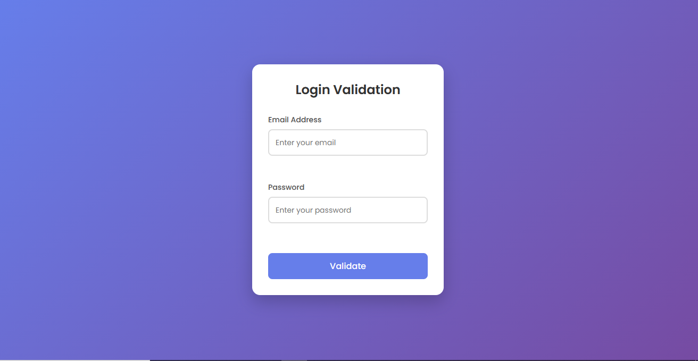

# 🔐 Email & Password Validator

A modern and responsive **Email & Password Validation UI** built using **HTML, CSS, and JavaScript**.
This project demonstrates real-time form validation with clean UI feedback and smooth user experience.

---

## 🚀 Live Demo

👉 https://priyanshu-gurjar20.github.io/Email-password-validator/

---

## 🚀 Features

* ✅ Real-time validation (`keyup` events)
* ✅ Email format validation using Regex
* ✅ Strong password validation (min 8 chars, uppercase, number)
* ✅ Dynamic error & success UI states
* ✅ Clean and modern UI design
* ✅ Responsive layout

---

## 🛠️ Tech Stack

* **HTML5**
* **CSS3**
* **JavaScript (Vanilla JS)**

---

## 📸 Preview



---

## 📂 Project Structure

```id="p9d2xw"
Email-password-validator/
│── validator.html
│── validator.css
│── validator.js
│── README.md
```

---

## ⚙️ How It Works

* User enters email and password
* JavaScript validates input on:

  * Form submit
  * Real-time typing
* UI updates dynamically:

  * ✅ Green border → Valid
  * ❌ Red border → Invalid
  * ⚠️ Error message shown

---

## 🧠 Validation Rules

### Email

* Must follow standard format (e.g., `example@gmail.com`)

### Password

* Minimum 8 characters
* At least 1 uppercase letter
* At least 1 number

---

## ▶️ Getting Started

```bash id="gh4ks9"
git clone https://github.com/Priyanshu-Gurjar20/Email-password-validator.git
cd Email-password-validator
```

Then open `validator.html` in your browser.

---

## 📈 Future Improvements

* 👁️ Show/Hide password toggle
* 📊 Password strength meter
* 🌙 Dark mode
* 🔔 Toast notifications

---

## 🤝 Contributing

Contributions are welcome! Feel free to fork and submit a pull request.

---

## 👨‍💻 Author

**Priyanshu Gurjar**
GitHub: https://github.com/Priyanshu-Gurjar20

---

## ⭐ Support

If you like this project, give it a ⭐ on GitHub!
